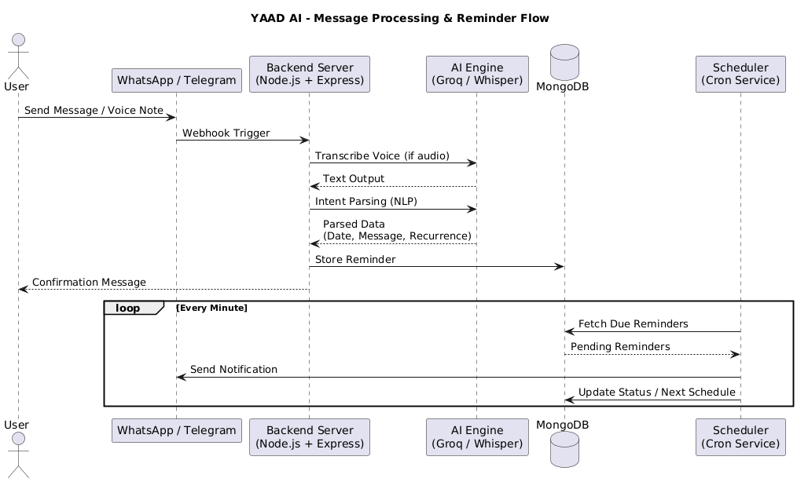

# YAAD AI

YAAD AI is an AI-powered reminder assistant that works through WhatsApp and Telegram. Users can create reminders using either text messages or voice notes, and the system automatically understands the intent, extracts scheduling information, and delivers reminders at the correct time.

The project is designed as a SaaS MVP with support for multilingual conversations, voice transcription, recurring reminders, and minute-level scheduling accuracy.

## Features

- Create reminders through WhatsApp and Telegram
- Support for both text and voice messages
- AI-powered speech-to-text transcription
- Natural language reminder parsing
- One-time reminders
- Daily recurring reminders
- Weekly recurring reminders
- Multilingual support (English, Hindi, Hinglish)
- Minute-level reminder scheduling
- Admin dashboard for monitoring and management
- Free-tier usage controls and abuse prevention

## How It Works

1. A user sends a text message or voice note through WhatsApp or Telegram.
2. The platform forwards the message to the backend through a webhook.
3. If the message is a voice note, it is transcribed into text.
4. The AI engine extracts the reminder details such as:
   - Reminder message
   - Date
   - Time
   - Recurrence pattern
5. The reminder is stored in MongoDB.
6. A confirmation message is sent back to the user.
7. The scheduler continuously checks for due reminders and sends notifications when required.

## Architecture



## Tech Stack

### Frontend

- React.js
- Tailwind CSS

### Backend

- Node.js
- Express.js

### AI Services

- Groq API
- Whisper Speech-to-Text

### Database

- MongoDB

### Messaging Platforms

- WhatsApp Business API
- Telegram Bot API

### Scheduling

- Cron Jobs

## Reminder Types

### One-Time Reminder

Example:

```text
Remind me tomorrow at 7 PM to call John
```

### Daily Reminder

Example:

```text
Remind me every day at 9 AM to take medicine
```

### Weekly Reminder

Example:

```text
Remind me every Monday at 8 AM for team meeting
```

## Voice Message Support

Users can create reminders by sending voice notes.

Example:

```text
Remind me to pay the electricity bill next Friday at 6 PM
```

The voice note is automatically transcribed and processed exactly like a text message.

## Supported Languages

- English
- Hindi
- Hinglish

## Database Design

### Users

| Field | Description |
|---------|-------------|
| user_id | WhatsApp number or Telegram ID |
| platform | WhatsApp or Telegram |
| created_at | Account creation timestamp |
| free_quota_used | Number of free reminders used |
| is_blocked | User access status |

### Reminders

| Field | Description |
|---------|-------------|
| reminder_id | Unique reminder identifier |
| user_id | Associated user |
| message | Reminder content |
| scheduled_time | Reminder execution time |
| recurrence | None, Daily, Weekly |
| status | Pending or Completed |
| created_at | Creation timestamp |
| next_run | Next execution time for recurring reminders |

### Delivery Logs

| Field | Description |
|---------|-------------|
| log_id | Unique log identifier |
| reminder_id | Associated reminder |
| attempt_time | Delivery attempt timestamp |
| status | Success or Failed |
| error_message | Failure details |

## Admin Dashboard

The admin dashboard provides:

- Total user count
- Active and completed reminder statistics
- Free-tier usage monitoring
- User blocking and unblocking
- Delivery and error logs

## Security

- User identity is linked to WhatsApp numbers or Telegram IDs
- API keys and secrets are stored using environment variables
- Protected webhook endpoints
- Rate limiting and abuse prevention mechanisms
- Spam detection controls

## Deployment

The application is deployed in a cloud environment and includes:

- Production-ready backend services
- MongoDB database
- Background scheduler service
- WhatsApp integration
- Telegram integration
- Environment-specific configurations

## Future Enhancements

- Custom reminder categories
- Calendar integration
- Email reminders
- Advanced analytics
- Multi-timezone support
- Team and shared reminders

## Project Status

This project is currently developed as a SaaS MVP focused on AI-powered reminder management through messaging platforms.